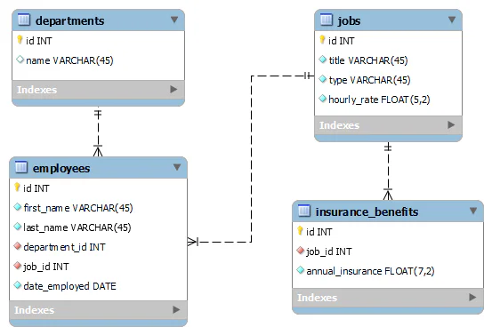

# Stage 4/4: Payroll Report
## Description
In this stage, combine everything you have done so far to generate a payroll report. Although you have only  
been provided with the time logs for employees in the City Ethics Commissions department, your procedure  
should work for any department:

| Full names        | Hours worked |
|-------------------|--------------|
| Dixie Herda       | 2095         |
| Stephen West      | 2091         |
| Philip Wilson     | 2160         |
| Robin Walker      | 2083         |
| Antoinette Matava | 2115         |
| Courtney Walker   | 2206         |
| Gladys Bosch      | 900          |

Let's discuss the columns. The base pay is the product of the regular hours for a typical work year and the hourly rate.  
The total pay is the sum of the base pay and overtime pay. The net income is derived by deducting the  
tax owed from the total pay.

Your task is to generate the payroll report. You might need to use the previous functions you created to  
generate overtime pay and tax owed in the earlier stages. You might also need to create a new function for this stage  
that will output the total hours worked by an employee. There are several ways to do it, using the `CASE` statement  
inside the function is just one of the ways.

## Objectives
- Create a procedure called `PayrollReport` that takes in the name of any department.
- Output the `full_names`, `base_pay`, `overtime_pay`, `total_pay`, `tax_owed`, and `net_income`.
- Order the table with the `net_income` column in descending order.
- Call the `PayrollReport` procedure on the `City Ethics Commission` department.

## Explanation of the database
You have a payroll management database with the following layout:

## Example
### Output:

| full_names        | base_pay | overtime_pay | total_pay | tax_owed | net_income |
|-------------------|----------|--------------|-----------|----------|------------|
| Philip Wilson     | 131164.8 | 6000.0       | 137164.8  | 26319.6  | 110845.25  |
| Dixie Herda       | 105768.0 | 1144.05      | 106912.05 | 19058.9  | 87853.16   |
| Stephen West      | 105768.0 | 838.97       | 106606.97 | 18985.7  | 87621.29   |
| Courtney Walker   | 89169.6  | 6000.0       | 95169.6   | 16244.8  | 78924.79   |
| Antoinette Matava | 73569.6  | 1856.75      | 75426.35  | 11901.3  | 63525.05   |
| Robin Walker      | 73569.6  | 159.15       | 73728.75  | 11527.8  | 62200.92   |
| Gladys Bosch      | 45780.8  | 0.0          | 45780.8   | 5379.28  | 40401.52   |